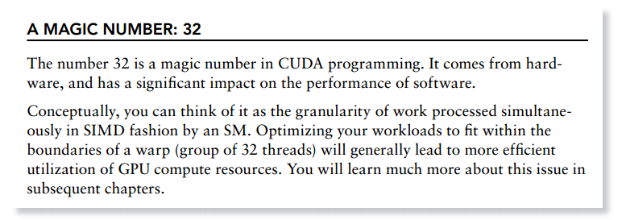

7_理解基本的CUDA执行模型-CUDA Execution Model 
==================================================
通过以前的知识我们知道如何去通过配置grid和block来lauch kernel, 
本章我们会有一些指导如何来配置grid和block来提高性能.

You might want to know if there are some guidelines for selecting
grid and block configurations. 

This chapter will answer those questions and provide you with deeper insight into kernel launch configurations and performance profile information,

but from a different angle: the hardware perspective.

GPU architecuture Overview 
------------------------------
GPU 是由一组流处理器的阵列来构成(Streaming Multiprocessors).

CUDA 组件

- CUDA cores
- Shared Memory/L1 Cache
- Register File
- Load/Store Units
- Special Function Units
- Warp Scheduler 

- SIMT VS SIMD

CUDA 是单指令多线程架构(SIMT - single Instruction Multiple Thread), 如此管理和执行以32个线程组成一组的warp.

在同一个warp中的所有线程在同一时间执行相同的指令,每个线程有自己的指令地址计数器和寄存器状态,有各自的数据.每个SM把block分成以32个线程的warp为一组来调度并执行.

SIMT有别与AMD的SIMD，SIMT的好处就是无需开发者费力把数据凑成合适的矢量长度，并且SIMT允许每个线程有不同的分支。 纯粹使用SIMD不能并行的执行有条件跳转的函数，很显然条件跳转会根据输入数据不同在不同的线程中有不同表现，这个只有利用SIMT才能做到。

一个重要不同是SIMD中的向量中的元素相互之间可以自由通信，因为它们存在于相同的地址空间（例如，都在CPU的同一寄存器中），而SIMT中的每个线程的寄存器都是私有的，线程之间只能通过shared memory和同步机制进行通信。

总结:
SIMT与SIMD本质相同：都是单指令多数据。
SIMT比SIMD更灵活，允许一条指令的多数据分开寻址；SIMD是必须连续在一起的片段。
SIMT形式上是多线程，本质上还是一个线程，只不过数据可以零散的分散开。但是如果你真的将数据分散开的话，执行效率上又会大打折扣，因为不满足并行访问的要求。
总之SIMT是SIMD的一种推广，更灵活而已。

- SIMT model include three key features that SIMD does not.

-1. Each thread has its own instruction address counter.

-2. Each thread has its own register state.

-3. Each thread can have an independent execution path.

CUDA GPU magic number 
--------------------------

threads的并行与同步
--------------------------

　需要注意的是，大部分threads只是逻辑上并行，并不是所有的thread可以在物理上同时执行。例如，遇到分支语句（if else，while，for等）时，各个thread的执行条件不一样必然产生分支执行，这就导致同一个block中的线程可能会有不同步调。另外，并行thread之间的共享数据会导致竞态：多个线程请求同一个数据会导致未定义行为。CUDA提供了cudaThreadSynchronize()来同步同一个block的thread以保证在进行下一步处理之前，所有thread都到达某个时间点。 
　　同一个warp中的thread可以以任意顺序执行，active warps被sm资源限制。当一个warp空闲时，SM就可以调度驻留在该SM中另一个可用warp。在并发的warp之间切换是没什么消耗的，因为硬件资源早就被分配到所有thread和block，所以该新调度的warp的状态已经存储在SM中了。不同于CPU，CPU切换线程需要保存/读取线程上下文（register内容），这是非常耗时的，而GPU为每个threads提供物理register，无需保存/读取上下文。 

THE Heart of THE GPU Architecture 
----------------------------------------

.. image:: ../image/heartofGPU.png

The Fermi Architecture
--------------------------------

The Kepler Architecture
--------------------------------

Kepler架构有一个特性,就是动态并行(Dynamic Parallelism)
它允许通过GPU端lauch kernel,而不是必须由host端launch kernel,这样可以省去与cpu的交互.

Profile-Driven Optimizaiton性能驱动的优化
----------------------------------------------

Profiling 可以分析程序性能通过测量:

- 代码的空间复杂度与时间复杂度.

- 特殊指令的使用

- 函数调用的频率与使用周期

Profiling tools provide deep insight into kernel performance and help you identify bottlenecks in
kernels. 

CUDA 提供了两种性能分析工具
-------------------------------------
CUDA provides two primary profiling tools: 

- nvvp, a standalone visual profiler; 
- nvprof, a command-line profiler.

- 1. nvvp 

nvvp is  a Visual Profiler, which helps you to visualize and optimize the performance of your CUDA program. This tool displays a timeline of program activity on both the CPU and GPU, helping you 
to identify opportunities for performance improvement. In addition, nvvp analyzes your application for potential performance bottlenecks and suggests actions to take to eliminate or reduce those 
bottlenecks. The tool is available as both a standalone application and as part of the Nsight Eclipse Edition (nsight).

- 2. nvprof

nvprof collects and displays profiling data on the command line. nvprof was introduced with
CUDA 5 and evolved from an older command-line CUDA profiling tool. Like nvvp, it enables the
collection of a timeline of CUDA-related activities on both the CPU and GPU, including kernel execution, memory transfers, and CUDA API calls. It also enables you to collect hardware counters and
performance metrics for CUDA kernels.

你将学到如何写高效的kernel通过使用profile-driven approach
----------------------------------------------------------------

Throughout the examples and exercises in this book, you will learn about the proper metrics for analyzing kernels with the command-line profiler and master the skill of writing an efficient kernel using the profile-driven approach.  

In this book, you will mainly use nvprof to dissect your kernel with the goal of improving performance. You will learn how to select appropriate counters and metrics, and use nvprof from the command line to collect profiling data, which can then be used to plan an optimization strategy. You will learn how to analyze your kernel from multiple angles using different counters and metrics.

影响性能的可能的原因
---------------------------

1. 存储带宽 Memory Bandwidth 
2. 计算资源
3. 指令与存储延迟  instruction and memory latency

